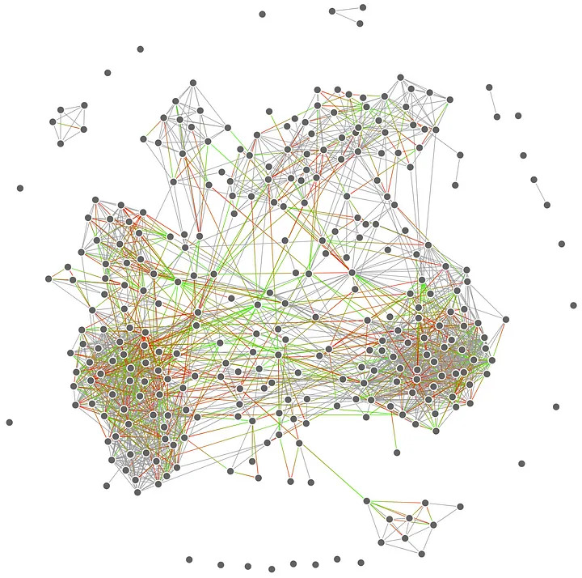

# Instagram Network Analysis (Updated 2024)

**Build an interactive network of your Instagram followers and their relations in 3 easy steps! (and quite some time)**

<sub>Example:</sub>\
\
<sup>Source: Medium page (shown below)</sup>

> [!NOTE]
> _**Proof of concept. Use at your own responsibility.**_\
> _I do not take responsibility for any consequences to Instagram accounts when using this project._\
> _To avoid errors, add 2FA, use Instaloader carefully, and follow the tips in this document._

## Step 0

Clone the repo:
```bash
git clone https://github.com/victor-gurbani/instagram_network_analysis/
cd instagram_network_analysis 
```
Install the dependencies:
```bash
pip install instaloader -U
pip install requirements.txt
```
And set your Instagram username (and browser user-agent) in the config.json file.
```bash
nano config.json
```

## Step 1

Login to Instagram either using

 1. Your preferred browser and run: `pip install browser-cookie3 -U && instaloader --load-cookies=BROWSER` _where BROWSER is chrome, firefox, safari, etc..._
 2. Instaloader CLI: `instaloader --login=USERNAME` _(not recommended)_
    
> [!IMPORTANT] 
> Add ***--user-agent*** with your browser's full user-agent when logging in with Instaloader\
> To avoid detection, use your browser for a few days before using any script.

## Step 2 

Start scraping your profile and your followers followers:
```bash
cd 01\ scraping/
python3 get_my_followers.py
python3 get_relations.py --wait-time 10
python3 relations_to_json.py
```
_**--wait-time** can be omitted but set it to a high value in seconds to avoid detection\
**--max-count** to set a limit on how many users to scrape before the script exits (progress is saved and can be resumed directly)_

To monitor the scraping you can `tail -F relations.txt `

> [!CAUTION]
> Errors occur after Instagram blocks the session due to suspecting that you are using bots.\
> **You must log in again to restore the Instaloader session.**

> [!TIP]
> Open your preferred browser and open Instagram. Without closing it, load the cookies (Step 1), and start the script. Do NOT close the browser window or interact with it during scraping. Use trustworthy accounts and do not use VPNs.

## Step 3 

Finished! Now **visualize the data!**

Go to the corresponding folder `02 visual` and copy the relations.json file:
```bash
cd 02\ visual/ && cp ../01\ scraping/relations.json relations.json
```
and _start_ or _open_ `index.html` in your preferred browser (with JS enabled).

## Step 4 (optional)

**Analyse the data**

First, go to the third folder copying the data:
```bash
cd 03\ analysis/ && cp ../01\ scraping/relations.* ./
```
And run the analysis scripts! 
(Update 19/12 All analysis tools work fine now!)

To view the community analysis run (with Louvain or Newman)
```bash
cd ../02\ visual/ && cp ../03\ analysis/relations_louvain.json ./relations.json
```
and open index.html in the browser to see the graph with the nodes coloured by communities.

---

Original step-by-step guide on how to use the code and interpret the results: https://medium.com/@maximpiessen/how-i-visualised-my-instagram-network-and-what-i-learned-from-it-d7cc125ef297

## Star History

[](https://star-history.com/#victor-gurbani/instagram_network_analysis&Date)
