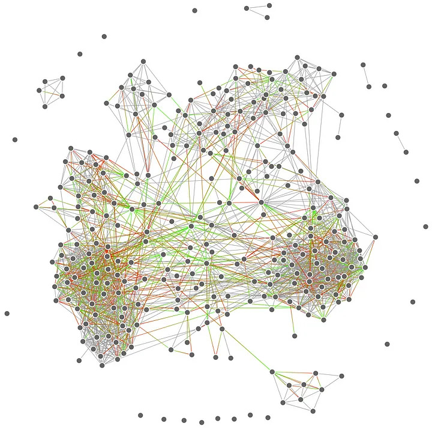

<div align="center">
 
# Instagram Network Analysis (Omni-Viz Edition)

*Build an interactive network of your Instagram followers and their relations. Now featuring Omni-Viz: deep analysis of hidden patterns and cultural hubs.*

<sub>Example:</sub>\
\
<sup>Source: [Medium page](https://medium.com/@maximpiessen/how-i-visualised-my-instagram-network-and-what-i-learned-from-it-d7cc125ef297)</sup>

</div>

> [!NOTE]
> **Proof of concept. Use at your own responsibility.**\
> _I do not take responsibility for any consequences to Instagram accounts when using this project._\
> _To avoid errors, add 2FA, use Instaloader carefully, and follow the tips in this document._

## Step 0

Clone the repo:
```bash
git clone https://github.com/victor-gurbani/instagram_network_analysis/
cd instagram_network_analysis 
```
Install the dependencies:
```bash
pip install instaloader -U
pip install -r requirements.txt
```
And set your Instagram username (and browser user-agent) in the config.json file.
```bash
nano config.json
```

## Step 1

Login to Instagram either using

 1. Your preferred browser and run: `pip install browser-cookie3 -U && instaloader --load-cookies=BROWSER` _where BROWSER is chrome, firefox, safari, etc..._
 2. Instaloader CLI: `instaloader --login=USERNAME` _(not recommended)_
    
> [!IMPORTANT] 
> Add ***--user-agent*** with your [browser's full user-agent](https://www.whatismybrowser.com/detect/what-is-my-user-agent/) when logging in with Instaloader\
> To avoid detection, use your browser for a few days before using any script.

## Step 2 

Start scraping your profile and your followers followers:
```bash
cd 01\ scraping/
python3 get_my_followers.py
python3 get_relations.py --wait-time 10
python3 relations_to_json.py
```
_**--wait-time** can be omitted but set to a high value in seconds to avoid detection (default: 10) \
**--max-count** to set a limit on how many users to scrape before the script exits (progress is saved and can be resumed directly) \
**--store-data** to store all scraped data in a folder for future use/analysis \
**--no-animation** self explanatory_

To monitor the scraping you can `tail -F relations.txt `

> [!CAUTION]
> Errors occur after Instagram blocks the session due to suspecting that you are using bots.\
> **You must log in again to restore the Instaloader session.**

> [!TIP]
> Open your preferred browser and open Instagram. Without closing it, load the cookies (Step 1), and start the script. Do NOT close the browser window or interact with it during scraping. Use trustworthy accounts and do not use VPNs.

## Step 3 

Finished! Now **visualize the data!**

Go to the corresponding folder `02 visual` and copy the relations.json file:
```bash
cd 02\ visual/ && cp ../01\ scraping/relations.json relations.json
```
and _start_ or _open_ `index.html` in your preferred browser (with JS enabled) (for example on [localhost:8080](http://localhost:8080/index.html)).

## Step 4 (optional)

**Analyse the data**

First, go to the third folder copying the data:
```bash
cd 03\ analysis/ && cp ../01\ scraping/relations.* ./
```
And run the analysis scripts! 
(Update 19/12/24 All analysis tools work fine now!)

To view the community analysis run (with Louvain or Newman)
```bash
cd ../02\ visual/ && cp ../03\ analysis/relations_louvain.json ./relations.json
```
and open [index.html](http://localhost:8080/index.html) in the browser to see the graph with the nodes coloured by communities.

### Dark Matter Analysis (requires `--store-data`)

If you scraped with `--store-data`, you can run the **external analysis** to uncover hidden patterns from full followee lists:

```bash
cd 03\ analysis/
python3 external_analysis.py --louvain_json relations_louvain.json --top_k_shadow 200
# change to --newman_json relations_newman.json for newman
```

This analyzes the "dark matter" — the full following lists of every scraped follower — to reveal:

| Feature | What it finds |
|---------|--------------|
| **Hidden Homophily** | Pairs who follow 40%+ of the same accounts but aren't connected — "Latent Friends" who should know each other |
| **Shadow Centers** | External accounts (brands, influencers, meme pages) that passively anchor your network's culture |
| **2nd Degree Reach** | Who gives you access to the widest *new* audience — the structural hole brokers |
| **Echo Chamber Score** | Who follows the same mainstream accounts as everyone else vs. the mavericks with unique taste |
| **Interest Bridges** | People from different friend groups who secretly share the same interests |

**Options:**
_**--followers_data_dir** path to stored follower data (default: `../01 scraping/followers_data/`) \
**--jaccard_threshold** minimum similarity to flag as latent friend (default: 0.15) \
**--top_k_shadow** number of shadow centers to report (default: 50) \
**--output_json** output file with enriched node data (default: `relations_darkmatter.json`) \
**--louvain_json** path to Louvain (also applicable to Newman by changing the name) community data for federal selection_

To visualize the dark matter analysis in the D3 graph:
```bash
cd ../02\ visual/ && cp ../03\ analysis/relations_darkmatter.json ./relations.json
```
And open `index_darkmatter.html`.

---

## The Omni-Viz Upgrade

The new visualization suite (`index_darkmatter.html`) transforms the static graph into a laboratory for social discovery.

### Interactive Tools
- **Pathfinder (Alt + Click)**: Select any two nodes to calculate and highlight the shortest path between them.
- **Culture Inspector (Shift + Drag)**: Select a group of nodes to see their top shared interests and shadow centers in the inspection panel.
- **Galaxy Mode**: Toggle "Enable Gravity" to let nodes be pulled toward the **Shadow Planets** they follow.
  - **Free Planets**: Unlock the planets to let them find their own center of gravity based on their audience.
  - **Planet Clustering**: Reorder planets by audience similarity to reveal cultural continents.
- **Diameter**: Calculate the structural width of your network with one click.
- **Unreachable Toggle**: Instantly fade out nodes that aren't part of the main connected component.

### New Metrics & Sizing
Color and size nodes by advanced network properties:
- **Tribe Loyalty**: Measures how much of a user's network stays within their own community.
- **Echo Chamber Score**: Identifies "Mavericks" (unique taste) vs. "Conformists" (follow local norms).
- **Unique Reach**: Who connects you to the most niche, external accounts.
- **PageRank & Betweenness**: Traditional centrality measures for identifying true influencers and bridge-builders.
- **K-Core (Peel)**: Visualize the layers of your network, from the periphery to the core.

---

[Original step-by-step guide on how to use the code and interpret the results](https://medium.com/@maximpiessen/how-i-visualised-my-instagram-network-and-what-i-learned-from-it-d7cc125ef297)

---

## Star History

<a href="https://star-history.com/#victor-gurbani/instagram_network_analysis&Date">
 <picture>
   <source media="(prefers-color-scheme: dark)" srcset="https://api.star-history.com/svg?repos=victor-gurbani/instagram_network_analysis&type=Date&theme=dark" />
   <source media="(prefers-color-scheme: light)" srcset="https://api.star-history.com/svg?repos=victor-gurbani/instagram_network_analysis&type=Date" />
   
 </picture>
</a>
